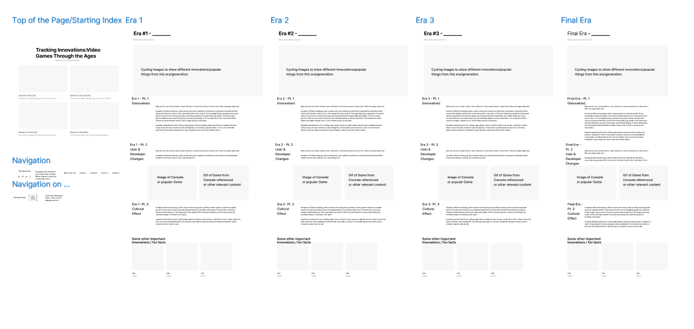
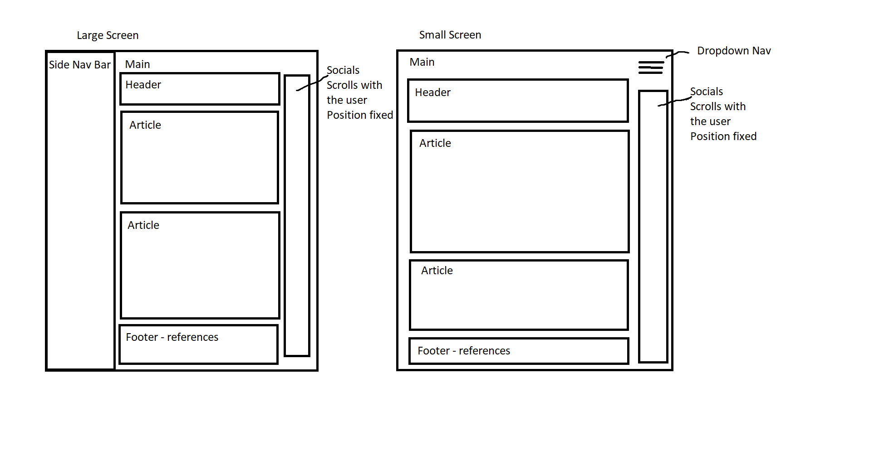

# Developments & Innovations in the Video Game Industry

## Summary

Over the years - starting as early as 1950, continuing on and growing in both popularity and relevance in culture - Video Games have been a part of many lives all around the world. 

You can vist the finished website here [here](https://sw33ws.github.io/Tracking-Innovation-Video-Games/)

## Table of Contents

- [Installation](#installation)
- [Usage](#usage)
- [Contact](#contact-info)

---

 
---

## Installation

Clone the repo onto your local drive, ```git clone git@github.com:sw33ws/Tracking-Innovation-Video-Games.git```

## Usage

First open it in vs code, then open it in the your browser, with a addon like ```open in browser, by TechER```.

## Contact Info

- https://github.com/sw33ws
- https://github.com/FrostyOnyx